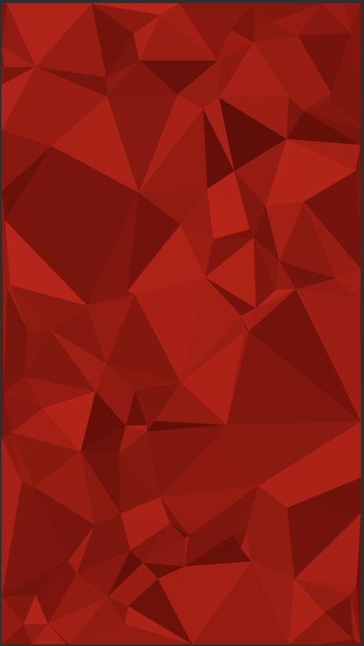

# Triangles view for Android
Widget with random triangles

[  ](https://bintray.com/sjowl/maven/trianglesview/_latestVersion)

** Gradle **
```Gradle
repositories {
    maven {url  "https://dl.bintray.com/sjowl/maven" }
}

compile 'au.sjowl.libs.view.triangularview:trianglesview:0.0.1'
```

** Usage **
```xml
<au.sjowl.libs.mesh.MeshView
        ...
        app:mv_baseColor="#990000"
        app:mv_dots="100" />
```


